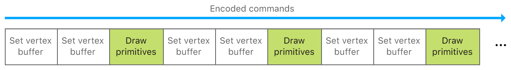
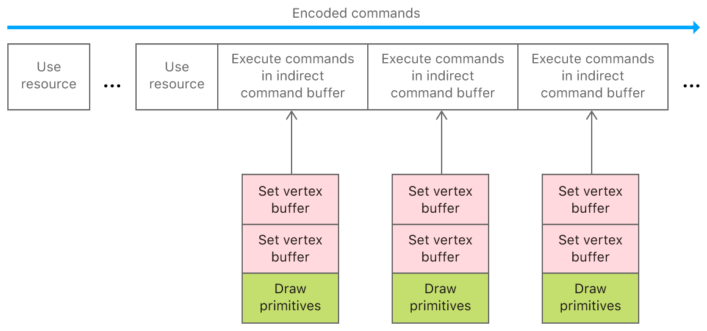
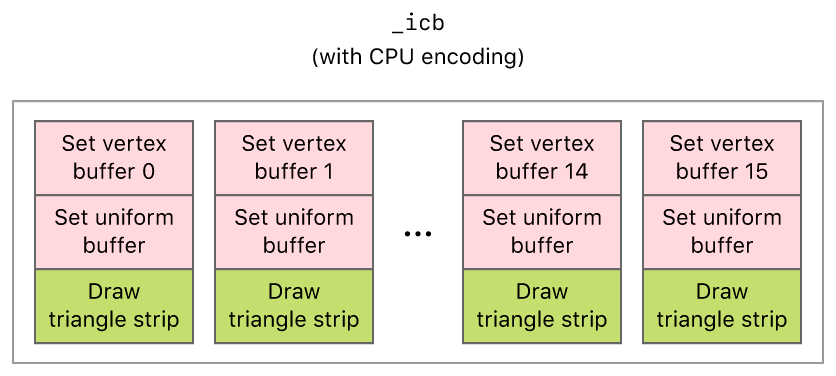
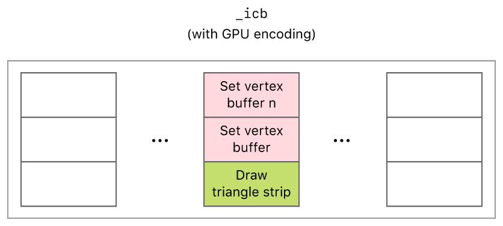

# Basic Indirect Command Buffers

Demonstrates how to encode an indirect command buffer with the CPU or GPU, and then execute its commands in a separate render command encoder.

## Overview

An indirect command buffer represents a group of commands that can be encoded with the CPU or GPU and executed repeatedly across multiple render command encoders. You use indirect command buffers to reduce CPU overhead, simplify command organization, and implement GPU-driven pipelines.

In this sample, you'll learn how to define, create, encode, and execute commands in an indirect command buffer. In particular, you'll learn about the different Metal API and Metal shading language features that you use to encode indirect command buffers. The sample renders a series of 16 shapes using two vertex buffers and a draw call encoded into an indirect command buffer.

## Getting Started

The Xcode project contains schemes for running the sample on macOS or iOS, with CPU or GPU encoding enabled. The schemes define a `USE_CPU` preprocessor macro that determines whether the sample uses the CPU or GPU to encode the indirect command buffer. Metal is not supported in the iOS Simulator, so the iOS schemes require a physical device to run the sample. The default scheme is `BasicIndirectCommandBufferCPUEncoding-macOS`, which runs the sample as is on your Mac with CPU encoding enabled.

Support for indirect command buffers starts with these feature sets:
* `MTLFeatureSet_iOS_GPUFamily3_v4`
* `MTLFeatureSet_iOS_GPUFamily4_v2`
* `MTLFeatureSet_macOS_GPUFamily2_v1`

The sample calls the `supportsFeatureSet:` method to check for support.

``` objective-c
    BOOL supportICB = NO;
#if TARGET_IOS
    supportICB = [_view.device supportsFeatureSet:MTLFeatureSet_iOS_GPUFamily3_v4];
#else
    supportICB = [_view.device supportsFeatureSet:MTLFeatureSet_macOS_GPUFamily2_v1];
#endif
```

## CPU Overhead and Indirect Command Buffers

Metal commands are efficient, incurring minimal CPU overhead when apps access the GPU. Each command does incur some overhead, however; to further reduce the amount, use these strategies:
* Do more GPU work with fewer CPU commands.
* Avoid repeating expensive CPU commands.

Metal's *indirect command buffer* feature reduces the number and performance cost of CPU commands in your app's critical path (for example, in your app's render loop). An indirect command buffer allows you to group and encode multiple commands within a single object, instead of encoding each command individually.

By encoding indirect command buffers with the CPU, you can shift a significant amount of CPU overhead from your app's critical path to its initial setup. By encoding indirect command buffers with the GPU, you can avoid expensive synchronization overhead between CPU encoding and GPU execution.

- Note: Indirect command buffers can be encoded with the CPU or GPU, but they can be executed only through the CPU.

## Individual Commands Versus Indirect Command Buffers

Metal apps, particularly games, typically contain multiple render commands, each associated with a set of render states, buffers, and draw calls. To execute these commands for a render pass, apps first encode them into a render command encoder within a command buffer.

You encode individual commands into a render command encoder by calling `MTLRenderCommandEncoder` methods such as `setVertexBuffer:offset:atIndex:` or `drawPrimitives:vertexStart:vertexCount:vertexCount:instanceCount:baseInstance:`.



Encoding numerous commands individually can become tedious and expensive, especially for large apps or games. Instead, you can encode related commands into an indirect command buffer and then set that entire object as a single command for a render pass. This approach greatly reduces CPU overhead and still encodes the intended commands for GPU execution.

Indirect command buffers are represented as `MTLIndirectCommandBuffer` objects. You encode them into a render command encoder by calling the `executeCommandsInBuffer:withRange:` method for each indirect command buffer.



- Note: To access individual buffers referenced by an indirect command buffer, you must call the `useResource:usage:` method for each buffer that you want to use. For more information, see the "Execute an Indirect Command Buffer" section.

## Define Render Commands and Inherited Render State

For the indirect command buffer, `_icb`, the sample defines render commands that:

1. Set a vertex buffer (using unique vertex data for each shape)
2. Set another vertex buffer (using common transformation data for all shapes)
3. Draw a triangle strip

The sample encodes these commands differently for the CPU or the GPU. However, these commands are still encoded into both versions of the indirect command buffer.

The sample also allows `_icb` to inherit the render pipeline state from its parent encoder, `renderEncoder`. Furthermore, `_icb` implicitly inherits any render state that can't be encoded into it, such as the cull mode and depth or stencil state for the render pass.

## Create an Indirect Command Buffer

The sample creates `_icb` from a `MTLIndirectCommandBufferDescriptor`, which defines the features and limits of an indirect command buffer.

``` objective-c
    MTLIndirectCommandBufferDescriptor* icbDescriptor = [[MTLIndirectCommandBufferDescriptor alloc] init];

    icbDescriptor.commandTypes = MTLIndirectCommandTypeDraw;
#if !TARGET_IOS
    icbDescriptor.inheritPipelineState = TRUE;
#endif
    icbDescriptor.inheritBuffers = FALSE;
    icbDescriptor.maxVertexBufferBindCount = 2;
    icbDescriptor.maxFragmentBufferBindCount = 0;

    _icb = [_device newIndirectCommandBufferWithDescriptor:icbDescriptor maxCommandCount:AAPLNumShapes options:0];
```

The sample specifies the types of commands, `commandTypes`, and the maximum number of commands, `maxCount`, so that Metal reserves enough space in memory for the sample to encode `_icb` successfully (with the CPU or GPU).

## Encode an Indirect Command Buffer with the CPU

From the CPU, the sample encodes commands into `_icb` with a `MTLIndirectRenderCommand` object. For each shape to be rendered, the sample encodes two `setVertexBuffer:offset:atIndex:` commands and one `drawPrimitives:vertexStart:vertexCount:instanceCount:baseInstance:` command.

``` objective-c
for (int indx = 0; indx < AAPLNumShapes; indx++)
{
    NSUInteger vertexCount = _vertexBuffer[indx].length/sizeof(AAPLVertex);

    id<MTLIndirectRenderCommand> cmd = [_icb indirectRenderCommandAtIndex:indx];

    [cmd setVertexBuffer:_vertexBuffer[indx] offset:0 atIndex:AAPLBufferIndexVertices];
    [cmd setVertexBuffer:_uniformBuffers offset:0 atIndex:AAPLBufferIndexUniforms];

    [cmd drawPrimitives:MTLPrimitiveTypeTriangleStrip
            vertexStart:0
            vertexCount:vertexCount
          instanceCount:1
           baseInstance:0];
}
```

The sample performs this encoding only once, before encoding any subsequent render commands. `_icb` contains a total of 16 draw calls, one for each shape to be rendered. Each draw call references the same transformation data, `_uniformBuffers`, but different vertex data, `_vertexBuffers[indx]`. Although the CPU encodes data only once, the sample issues 16 draw calls per frame.



Because `_icb` inherits its render state from its parent encoder, it implicitly inherits the `MTLCompareFunctionEqual` value set for the depth comparison function of the render pipeline.

``` objective-c
MTLDepthStencilDescriptor *depthStateDesc = [[MTLDepthStencilDescriptor alloc] init];
depthStateDesc.depthCompareFunction = MTLCompareFunctionEqual;
depthStateDesc.depthWriteEnabled = YES;
_depthState = [_device newDepthStencilStateWithDescriptor:depthStateDesc];
```

``` objective-c
[renderEncoder setDepthStencilState:_depthState];
```

Therefore, all 16 draw calls are executed in a given render pass, but only one draw call passes the depth test (determined by the depth value of each shape).

## Encode an Indirect Command Buffer with the GPU

An indirect command buffer can be passed to a graphics or compute function only through an argument buffer, as a scalar or within an array. Within the argument buffer structure, an indirect command buffer occupies a specific index value, `[[id(n)]]`, just like any other argument does.

The sample encodes `_icb` into `_kernelShaderArgumentBuffer`, which is defined with the `arguments` structure where `AAPLArgumentBufferIDICB` is the index value for the indirect command buffer.

``` metal
typedef struct arguments {
    command_buffer cmd_buffer [[ id(AAPLArgumentBufferIDICB) ]];
    constant AAPLUniforms * uniforms [[ id(AAPLArgumentBufferIDUniformBuffer) ]];
    float depth [[ id(AAPLArgumentBufferIDDepth) ]];
    array<device float *, AAPLNumShapes> vertex_buffers [[ id(AAPLArgumentBufferIDVertexBuffer) ]];
    array<uint8_t, AAPLNumShapes> vertex_num [[ id(AAPLArgumentBufferIDVertexNumBuffer) ]];
} arguments;
```

``` objective-c
[argumentEncoder setArgumentBuffer:_kernelShaderArgumentBuffer offset:0];
[argumentEncoder setIndirectCommandBuffer:_icb atIndex:AAPLArgumentBufferIDICB];
```

Additionally, the sample calls the `useResource:usage:` method to indicate that the GPU can access `_icb`.

``` objective-c
[computeEncoder useResource:_icb usage:MTLResourceUsageWrite];
```

The sample passes `_kernelShaderArgumentBuffer`, which contains `_icb`, to the `kernelShader` kernel function.

``` objective-c
[computeEncoder setBuffer:_kernelShaderArgumentBuffer
                   offset:0
                  atIndex:0];
```

``` metal
kernel void kernelShader(uint cmd_idx [[ thread_position_in_threadgroup ]],
                         device arguments &args [[ buffer(AAPLVertexBufferIndexArgument) ]])
```

From the GPU, the sample encodes commands into `_icb`, through `cmd_buffer`, with a `render_command` structure. For each shape to be rendered, the sample executes the `kernelShader` kernel function. In this function, if the depth value of the current shape matches the depth value of the current frame, the sample encodes two `set_vertex_buffer` commands and one `draw_primitives` command.

``` metal
render_command cmd(args.cmd_buffer, cmd_idx);
if (args.depth == (((device AAPLVertex *)args.vertex_buffers[cmd_idx])[0].position.z) / AAPLNumShapes)
{
    cmd.set_vertex_buffer(args.vertex_buffers[cmd_idx], AAPLBufferIndexVertices);
    cmd.set_vertex_buffer(args.uniforms, AAPLBufferIndexUniforms);
    cmd.draw_primitives(primitive_type::triangle_strip, 0, args.vertex_num[cmd_idx], 1, 0);
}
```

The sample performs this encoding once every 16 frames, in order to encode different data into the indirect command buffer for those frames. `_icb` contains a single draw call for the shape to be rendered. This draw call references the transformation data in `uniforms` and the vertex data in `vertex_buffers[cmd_idx]`. Although the GPU encodes data multiple times, the sample issues only one draw call per frame.



## Optimize an Indirect Command Buffer

Because you set a buffer and render pipeline state for each draw command, some of this state can be redundant. After encoding commands, the sample calls the `optimizeIndirectCommandBuffer:withRange:` method to encode a blit operation that optimizes the contents of `_icb`. When Metal executes this operation, it attempts to remove redundant state within a specific range of the indirect command buffer. This optimization reduces the associated execution costs of the redundant state.

- Note: The `reset()` command makes a draw a no-op, which adds some GPU overhead to the indirect command buffer. The optimization operation also reduces this additional cost.

If the sample encodes `_icb` with the CPU, it then encodes the optimization operation in a separate command buffer.

``` objective-c
id <MTLCommandBuffer> commandBuffer = [_commandQueue commandBuffer];
commandBuffer.label = @"Indirect Command Buffer Optimization";

id<MTLBlitCommandEncoder> blitEncoder = [commandBuffer blitCommandEncoder];
blitEncoder.label = @"Indirect Command Buffer Optimization Encoding";

[blitEncoder optimizeIndirectCommandBuffer:_icb withRange:NSMakeRange(0, AAPLNumShapes)];
[blitEncoder endEncoding];

[commandBuffer commit];
[commandBuffer waitUntilCompleted];
```

If the sample encodes `_icb` with the GPU, it also encodes the optimization operation in the same command buffer.

``` objective-c
id<MTLBlitCommandEncoder> blitEncoder = [commandComputeBuffer blitCommandEncoder];
blitEncoder.label = @"Indirect Command Buffer Optimization";

[blitEncoder optimizeIndirectCommandBuffer:_icb withRange:NSMakeRange(0, AAPLNumShapes)];
[blitEncoder endEncoding];

[commandComputeBuffer commit];
[commandComputeBuffer waitUntilCompleted];
```

- Note: The `optimizeIndirectCommandBuffer:withRange:` command doesn't remove all redundant state, but it does remove a significant portion within hardware-dependent windows to the command buffer. This implementation achieves adequate parallelization for the optimization operation while significantly reducing redundant state.

## Execute an Indirect Command Buffer

The sample calls the `executeCommandsInBuffer:withRange:` method to execute the commands in `_icb`, whether `_icb` was encoded with the CPU or GPU.

``` objective-c
[renderEncoder executeCommandsInBuffer:_icb withRange:NSMakeRange(0, AAPLNumShapes)];
```

- Note: If an indirect command buffer is optimized, you can't call the `executeCommandsInBuffer:withRange:` method with a range that starts within the optimized region. You should specify a range that starts at the beginning of the optimized region and finishes at the end or within the optimized region.

Similar to the arguments in an argument buffer, the sample calls the `useResource:usage:` method to indicate that the GPU can access the resources within an indirect command buffer.

``` objective-c
[renderEncoder useResource:_uniformBuffers usage:MTLResourceUsageRead];
for (int indx = 0; indx < AAPLNumShapes; indx++)
{
    [renderEncoder useResource:_vertexBuffer[indx] usage:MTLResourceUsageRead];
}
```

The sample continues to execute `_icb` multiple times in subsequent render command encoders, as long as `_icb` contains valid commands to be executed.
